In this post, I build a highly available Kubernetes cluster.

TODO fix helm versions

TODO docker registry...

TODO nfs backup longhorn not working...

<!--more-->

## History & Why
Back in 2019, I was one of the early adopters of running Kubernetes on a Raspberry Pi, when ARM support
finally came available in beta. And even got a few mentions on places like Stackoverflow
[[1]](https://stackoverflow.com/questions/61011414/unable-to-access-nginx-nodeport-service-in-k8-cluster-running-on-rpi)
[[2]](https://stackoverflow.com/questions/60432834/why-does-ingress-on-my-kubernates-cluster-doesnt-respond-on-specified-host-usi).
You can read the [original article](../2019-09-21-raspberry-pi-kubernetes-cluster).

After six years of successful operation, with only a minor rebuild around 2022, there were a few motivations to
upgrade...
- Concerns about how much longer the microsds could last, some being six years old.
  - And attempting to take a backup would be too risky, and failure would be disruptive.
- Running only a single control plane node - YOLO.
- Most workloads on Raspberry Pi 4Bs - outdated and under-powered for 2025!

And the purpose and scale of my cluster had grown a lot, here's present state...

````mermaid
mindmap
  root((Home k8s Cluster))
    sh) Smart Home Microservices (
        Dashboard
        Dynamic DNS
        Home State
        Homepage
        Shareprice
        Undisclosed Service
        Trainbar Dashboard
        Uptime
        Weather
        Hibernate
        Light Switches
        Motion Lights
        State Trigger
        Smart Meter
        Sentinel
        Transport
    sup) k8s Supporting (
        Docker Registry
        Postgres via CrunchyData
        NFS Storage
        Vector
        Grafana
        Loki
        Istio
    svc) Services (
        Mumble VoIP Server
        Undisclosed Service
        Undisclosed Service
        Undisclosed Service
        Open Speed Test
        Ollama
        tmp("Temporary Game Server(s)")
````

Originally, the cluster was [just for a custom-made distributed smart-home written in nodejs](../2022-02-19-smart-home/).

Now, everything from databases (with Crunchydata's Postgres operator),
gaming servers to undisclosed services with heavy loads are running on it. I even added a 2U rackmount ATX worker node that was effectively
a gaming PC. But another risk, I only had a single node able to be that workhorse, despite a dual-module
redundant PSU being installed.

After this many years, and the heavy utilisation beyond the original envisioned hack project,
it was time to rebuild.

And since it controls the lights in my house, the switch-over needed to be minimum.


## Using AI to Migrate Services
Shout-out to [JetBrains Goland](https://www.jetbrains.com/go/) for the built-in AI features, which have been used
to migrate a lot of microservices from Node.js to Golang.

This has been done for a few reasons:
- Reduced runtime memory and CPU utilisation, generally greater performance
  - Since Node.js is interpreted, whereas Golang is highly optimised machine code.
- Smaller container images with no effort.
- Better support for multi-threading, useful for e.g. background jobs.

Both ecosystems have my own monolithic library to reduce and industrialise code.

## The Rebuild...
Topology of the old Kubernetes (k8s) cluster:


````mermaid
mindmap
    root) Cluster (
        Control Plane Nodes
            <b>k8-control1</b><br />192.168.1.100<br />Raspberry PI 4B 4gb
        Worker Nodes
            <b>k8-worker1</b><br />192.168.1.101<br />Raspberry PI 4B 4gb
            <b>k8-worker2</b><br />192.168.1.102<br />Raspberry PI 4B 4gb
            <b>k8-hc-worker1</b><br />192.168.1.110<br />Used for heavy workloads, 8 core 16 thread 64gb DDR4.
````

Topology of the new Kubernetes (k8s) cluster:

````mermaid
mindmap
    root) Cluster (
        Control Plane Nodes
            <b>k8-control0</b><br />192.168.4.10<br />Raspberry PI 5B 4gb
            <b>k8-control1</b><br />192.168.4.11<br />Raspberry PI 5B 4gb
            <b>k8-control2</b><br />192.168.4.12<br />Raspberry PI 5B 4gb
        Worker Nodes
            <b>k8-worker0</b><br />192.168.4.20<br />Ryzen Mini PC 8 core 16 thread 32gb DDR5
            <b>k8-worker1</b><br />192.168.4.21<br />Ryzen Mini PC 8 core 16 thread 32gb DDR5
````


## Network
I've got a [Mikrotik CCR2004-1G-12S+2XS](https://mikrotik.com/product/ccr2004_1g_12s_2xs) router. Not only does
it feature 10gbps and 25gbps [SFP](https://en.wikipedia.org/wiki/Small_Form-factor_Pluggable) ports, it has many
advanced and customisable features, such as:
- Multiple IP address pools
- BGP routing

We'll use both of these features in later sections.


### Setup IP Address Pools
I've decided to setup two IP ranges for my Kubernetes cluster:
- `192.168.4.0/24` - for the control plane and worker nodes.
- `192.168.5.0/24` - for allocating IPs to services for external ingress.

This enables putting the cluster on an isolated VLAN in the future if needed, and avoids
potential clashes from the various guests and devices on the rest of the network (non-k8s) using DHCP on a different
IP range.


With a Mikrotik router, you just need to setup an address list (this will automatically create the routing
between any other IP lists). I've got mine tied to a virtual interface, _bridge-LAN_, that bridges multiple physical
interfaces to form a LAN:

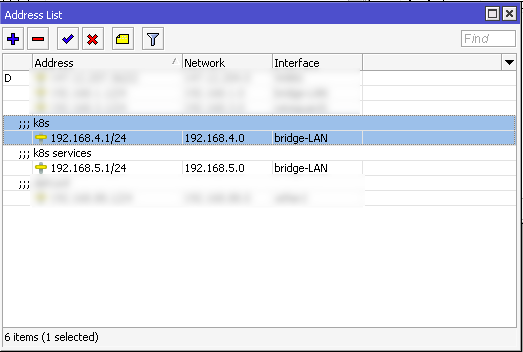

And in my case, I needed to update a firewall list for LAN IPs - used to allow cross-communication between LAN devices:

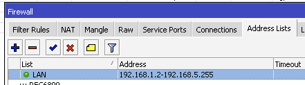


### Setup BGP (Routing) Peering
We'll use [BGP routing](https://en.wikipedia.org/wiki/Border_Gateway_Protocol) for two purposes:
- __Control plane load balancing:__ enable the control plane to use BGP routing for high availability of the Kubernetes
  cluster control plane.
- __Worker node external IP addresses:__ enable worker nodes to advertise IPs from `192.168.5.0/24` for individual
  (Kubernetes) services.

Before the next step, we need to setup  between the
main router and control plane nodes, so we can peer the control plane nodes.

For each node, we need to add a BGP connection:

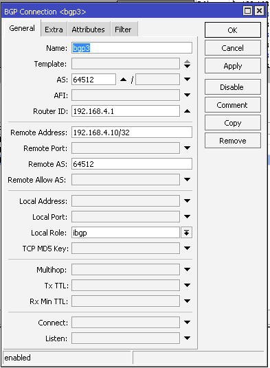

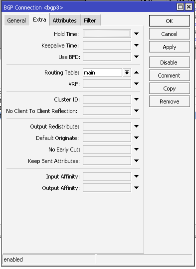

And we'll end up with something like:

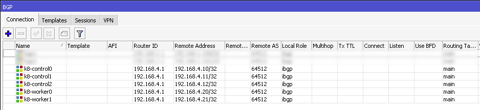


## Generic Control Plane & Worker Machine Setup
Download Debian 13 to a USB device, and install on each machine, with SSH server enabled, and no
graphical interface (not needed).

Install some common utility packages:

````bash
sudo apt install -y net-tools dnsutils sudo vim htop
````

### Disable Swap
Swap must be disabled, for stability, when running Kubernetes.

By default, swap will be enabled on most installations:
````bash
root@k8-control0:~# swapon --show
NAME       TYPE      SIZE USED PRIO
/dev/zram0 partition   2G   0B  100
````

Thus, to disable swap:
````bash
sudo systemctl mask swap.target
````

Quick reboot:
````bash
sudo reboot
````

And validate it's now disabled (should return nothing):
````bash
sudo swapon --show
````


### Non-Raspberry Pi Steps
__Note: for the network configuration demonstrated in this section, you could use NetworkManager (via nmtui) as shown in
the Raspberry Pi section. NetworkManager is best practice for Linux, I've opted for an older setup process, either can
work.__

Make my non-root user a sudoer, so I can use root from SSH:

````bash
adduser limpygnome sudo
````

Configure network:
`vim /etc/network/interfaces`

Comment out other config for the primary interface, named `eno1` in my case
(change details as needed for your network):

````bash
# Allow network cable to be changed
allow-hotplug eno1

# Ensure network interface starts automatically
auto eno1

# Set static network config
iface eno1 inet static
    address 192.168.4.20
    netmask 255.255.255.0
    gateway 192.168.4.1
    dns-nameservers 192.168.4.1

# Set IPv6 to automatic (DHCP)
iface eno1 inet6 auto
````

_Note: you can find your current network interface by running `ifconfig`._

And apply the new network settings:
````bash
service systemctl restart networking
````

And for DNS, as DHCP manager is disabled, we can just override the _resolv.conf_ file:
````bash
sudo bash -c 'cat > /etc/resolv.conf <<EOF
nameserver 192.168.4.1
EOF'
````


### Raspberry Pi Steps
Use the following command to set the network configuration:
````bash
sudo nmtui
````

Example:
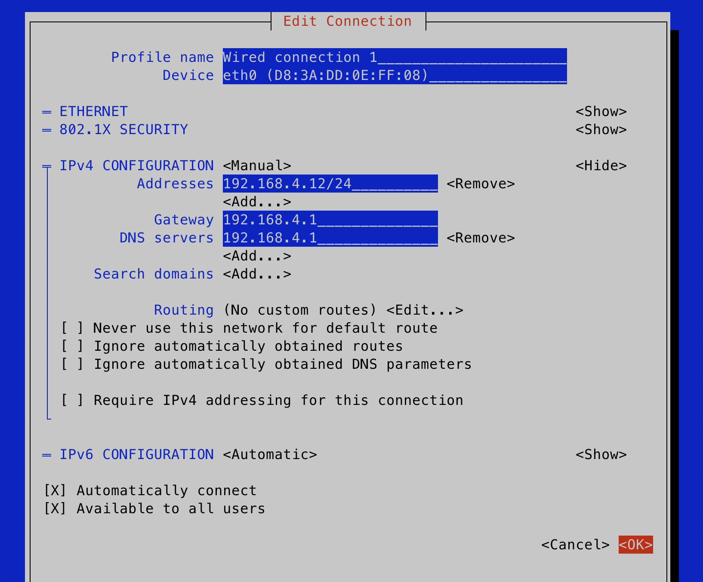

And either reboot or restart the network manager to apply changes:
````bash
sudo systemctl restart NetworkManager
````

Next, we need to enable a Linux kernel feature called cgroup (control group) for memory management, which is not
enabled out of the box on a Raspberry Pi. This will enable Kubernetes to offload the memory management to the operating
system, for consistent resource limiting (via throttling or killing processes with out-of-memory / OOM exit codes).

We'll need to enable the command-line used to boot the operating system, let's edit it:
````bash
sudo vim /boot/firmware/cmdline.txt
````

At the end of the line, add:
````bash
cgroup_enable=memory cgroup_memory=1
````

Save the file, and reboot:
````bash
sudo reboot
````


## Enable Packet Forwarding (All Nodes)
We need to enable all nodes to function as routers, so the Kubernetes container networking can pass
packets between nodes directly:

````bash
echo "net.ipv4.ip_forward=1" | sudo tee /etc/sysctl.d/99-kubernetes.conf
sudo sysctl --system
````

## Setup containerd (All Nodes)
_containerd_ is used to run the containers, a container runtime, equivalent to Docker in the past. 

Install the required package:
````bash
sudo apt install -y containerd
````

Ensure we use _systemd_ (which uses cgroups) for managing resources (CPU, memory, etc) of containers:
````bash
sudo mkdir -p /etc/containerd

containerd config default | sudo tee /etc/containerd/config.toml >/dev/null

sudo sed -i 's/SystemdCgroup = false/SystemdCgroup = true/' /etc/containerd/config.toml
````

Restart _containerd_, and have it automatically startup:
````bash
sudo systemctl restart containerd
sudo systemctl enable containerd
````


## Install Kubernetes (All Nodes)
We'll be using v1.34.2 (the latest at the time of this article), check for the latest
release [here](https://github.com/kubernetes/kubernetes/releases).

Install the repository and the components:
````bash
sudo apt install -y apt-transport-https curl gpg

sudo mkdir -p /etc/apt/keyrings

curl -fsSL https://pkgs.k8s.io/core:/stable:/v1.34/deb/Release.key \
  | sudo gpg --dearmor -o /etc/apt/keyrings/kubernetes-apt-keyring.gpg

echo "deb [signed-by=/etc/apt/keyrings/kubernetes-apt-keyring.gpg] \
https://pkgs.k8s.io/core:/stable:/v1.34/deb/ /" \
  | sudo tee /etc/apt/sources.list.d/kubernetes.list

sudo apt update

sudo apt install -y kubelet kubeadm kubectl
````

And prevent automatic upgrades:
````bash
sudo apt-mark hold kubelet kubeadm kubectl
````

This is to ensure we upgrade all the nodes together in the future. Otherwise, we risk
updates breaking nodes.

Since containerd points at a different directory for `cni` to the Debian default, we'll just symlink:
````bash
sudo ln -s /opt/cni/bin /usr/lib/cni
````


### Setup kube-vip (All Control Plane Nodes)
Apply these steps to each control plane node.

In my case, this will be: `k8-control0`, `k8-control1`, and `k8-control2`.

We're going to install kube-vip as a container, independent of Kubernetes, which will provide a 
virtual IP for the control plane nodes to use for load balancing, for high availability. I've opted
to use BGP routing, so my local network switch is doing the heavy lifting.

These steps were derived from here, and may change over time:
- <https://kube-vip.io/docs/installation/static/>

We first define env variables for the IP of the VIP, the interface to announce the VIP,
and the version of kube-vip to be used:
````bash
export VIP=192.168.4.100
export INTERFACE=eth0
export KVVERSION=v1.0.2
````

And setup an alias to run kube-vip using containerd:
````bash
alias kube-vip="ctr image pull ghcr.io/kube-vip/kube-vip:$KVVERSION; ctr run --rm --net-host ghcr.io/kube-vip/kube-vip:$KVVERSION vip /kube-vip"
````

And generate a manifest (config file) for BGP:
````bash
kube-vip manifest pod \
    --interface $INTERFACE \
    --address $VIP \
    --controlplane \
    --services \
    --bgp \
    --localAS 64512 \
    --bgpRouterID 192.168.4.1 \
    --bgppeers 192.168.4.10:64512::false,192.168.0.11:64512::false,192.168.0.12:64512::false | tee /etc/kubernetes/manifests/kube-vip.yaml
````


### Setup First Control Node
Login to the first control plane node, `k8-control0` in my case.

Run the following to setup a new cluster:
````bash
kubeadm init \
  --control-plane-endpoint "192.168.4.100:6443" \
  --pod-network-cidr=10.244.0.0/16 \
  --service-cidr=10.244.240.0/20 \
  --token-ttl=0 \
  --upload-certs
````

__Make sure to save the joining command (`kubeadm join ... --token ...` for later).__

__Note:__ The argument `--upload-certs` will store the control plane certificates as a secret, which expires
after two hours. This makes it easier to add additional control plane nodes, but it must be done before
expiry. Otherwise, you'll need to manually copy the certificates from `/etc/kubernetes/pki/`
to the other control plane machines, or run the following to re-create the secret with a two hour expiry:
````bash
kubeadm init phase upload-certs --upload-certs
````

__Warning:__ this will create a joining token that does not expire. This has been done for simplicity,
and should NOT be used for any production workloads.

### Setup kubectl

````bash
mkdir -p $HOME/.kube
sudo cp -i /etc/kubernetes/admin.conf $HOME/.kube/config
sudo chown $(id -u):$(id -g) $HOME/.kube/config
````

### Install Container Networking
We're going to use _Calico_.

Install it into the cluster by running:
````bash
kubectl apply -f https://docs.projectcalico.org/manifests/calico.yaml
````


And check all the pods are starting up:
````bash
kubectl get pods -A
````

_Pro-tip:_ rather than smashing the command, use `watch -n 1 kubectl get pods -A`.

And check the control plane node is reported as _Ready_:
````bash
kubectl get nodes
````

### Add Remaining Control Nodes
In this case, adding `k8-control1` and `k8-control2`.

Login to each control plane node, and run the join command outputted earlier that contains
`--control-plane` and `--certificate-key` (`kubeadm join ... --control-plane ... --certificate-key ...`).

### Add Worker Nodes
Login to `k8-worker0`, `k8-worker1`, and `k8-worker2`.

Apply the joining command outputted earlier that does __not__ contain `--control-plane` and `--certificate-key`.


## Helm
For various installations, we'll be using helm.

For these steps, you could run this anywhere with kubectl access. For simplicity, I'll do this from `k8-control0`.

We'll run the installation from `k8-control0`.

Taken from the official [install helm](https://helm.sh/docs/intro/install/#from-apt-debianubuntu) steps:
````bash
sudo apt-get install curl gpg apt-transport-https --yes
curl -fsSL https://packages.buildkite.com/helm-linux/helm-debian/gpgkey | gpg --dearmor | sudo tee /usr/share/keyrings/helm.gpg > /dev/null
echo "deb [signed-by=/usr/share/keyrings/helm.gpg] https://packages.buildkite.com/helm-linux/helm-debian/any/ any main" | sudo tee /etc/apt/sources.list.d/helm-stable-debian.list
sudo apt-get update
sudo apt-get install helm
````

## kubectl on Local Machine
Logon to `k8-control0`, and ensure the file `~/.kube/config` exists on a user that can login via SSH.

If you have the file under the `root` user, first copy it to a non-root user that can SSH. For example, logged-in
as the non-root user:
````bash
mkdir -p ~/.kube

sudo cp /root/.kube/config ~/.kube/

sudo chown $USER:$USER ~/.kube/config
````

And test it works:
````bash
kubectl get node
````

And then on your local machine:
````bash
scp your_username@192.168.4.10:~/.kube/config ~/.kube/
````

And if you haven't installed `kubectl`, install it. Example for Mac:
````bash
brew install kubernetes-cli
````

And on your local machine, test it works:
````bash
kubectl get nodes
````


## Kubernetes Dashboard
A useful tool to check the health of the cluster is the Kubernetes Dashboard.

Run the following:
````bash
helm repo add kubernetes-dashboard https://kubernetes.github.io/dashboard/

helm repo update

helm upgrade --install kubernetes-dashboard kubernetes-dashboard/kubernetes-dashboard --create-namespace --namespace kubernetes-dashboard
````

We'll now create a user that can login to the dashboard.

Put the following in the file `dashboard-user.yaml`:
````yaml
apiVersion: v1
kind: ServiceAccount
metadata:
  name: admin-user
  namespace: kubernetes-dashboard
---
apiVersion: rbac.authorization.k8s.io/v1
kind: ClusterRoleBinding
metadata:
  name: admin-user
roleRef:
  apiGroup: rbac.authorization.k8s.io
  kind: ClusterRole
  name: cluster-admin
subjects:
- kind: ServiceAccount
  name: admin-user
  namespace: kubernetes-dashboard
````

And apply it:
````bash
kubectl apply -f dashboard-user.yaml
````

From your local dev machine (not a control plane node), you can port forward the dashboard
to a local port to access it in a browser:
````bash
kubectl -n kubernetes-dashboard port-forward svc/kubernetes-dashboard-kong-proxy 8443:443
````

_Note: navigate to [kubectl on Local Machine](#kubectl-on-local-machine) section above if you need to setup kubectl
on your machine._

And open the following URL in your browser:
- <https://localhost:8443/>

And generate a token to login to the above page:
````bash
kubectl -n kubernetes-dashboard create token admin-user
````


## Setup Storage
For distributed (block) storage, we'll use [Longhorn](https://longhorn.io/).

This will enable services to ask for storage, which is then replicated between other worker nodes, and backed-up
to an [NFS](https://en.wikipedia.org/wiki/Network_File_System) mount outside the cluster.

### Installation
First, we'll install the required packages on every single node:
````bash
apt install -y open-iscsi
````

And enable, and startup, iSCSID:
````bash
sudo systemctl enable --now iscsid
sudo systemctl status iscsid
````

And from `k8-control0`, we'll install Longhorn onto Kubernetes using helm:
````bash
helm repo add longhorn https://charts.longhorn.io

helm repo update

helm install longhorn longhorn/longhorn --namespace longhorn-system --create-namespace --version 1.10.1
````

### Setup Storage Class
Longhorn will store data at the default path `/var/lib/longhorn/`. For this setup, we're going to leave
it unchanged.


### Setup Backups
We'll backup storage to an NFS drive every night.

On all nodes, make sure nfs is installed:
````bash
apt install -y nfs-common
````

Configure Longhorn with an NFS mount as a backup target...

Put the following in the file `longhorn-backup-target.yaml`:
````yaml
apiVersion: longhorn.io/v1beta2
kind: BackupTarget
metadata:
  name: default
  namespace: longhorn-system
spec:
  backupTargetURL: "nfs://192.168.1.200:/k8-data/longhorn-backup"
  credentialSecret: ""
  pollInterval: "300s"
````

And apply it:
````bash
kubectl apply -f longhorn-backup-setting.yaml
````

_Note: in my setup, I have a NAS with an NFS endpoint setup, not covered by this guide._

Create a nightly job to perform the backup...

Put the following in the file `longhorn-backup.yaml`:
````yaml
apiVersion: longhorn.io/v1beta2
kind: RecurringJob
metadata:
  name: nightly-backup
  namespace: longhorn-system
spec:
  name: nightly-backup
  task: backup
  cron: "0 3 * * *"   # Every night at 03:00
  retain: 1           # Keep 1 backups
  concurrency: 1
  groups:
    - default
````

And apply it:
````bash
kubectl apply -f longhorn-backup.yaml
````

### Create Storage Class
This is effectively configuration to use Longhorn, and how to use it, with volume claims.

Put this in the file `longhorn-storage-class.yaml`:
````yaml
kind: StorageClass
apiVersion: storage.k8s.io/v1
metadata:
  name: longhorn-retain
  annotations:
    storageclass.kubernetes.io/is-default-class: "true"
provisioner: driver.longhorn.io
allowVolumeExpansion: true
reclaimPolicy: Retain
volumeBindingMode: Immediate
parameters:
  numberOfReplicas: "2"
  staleReplicaTimeout: "2880"
  fromBackup: ""
  fsType: "ext4"
````

And apply it:
````bash
kubectl apply -f longhorn-storage-class.yaml
````

### Create Volume
We can now create a volume, let's test it.

Put this in the file `longhorn-test.yaml`:
````yaml
apiVersion: v1
kind: Namespace
metadata:
  name: testing
---
apiVersion: v1
kind: PersistentVolumeClaim
metadata:
  name: test-pvc
  namespace: testing
spec:
  accessModes:
  - ReadWriteOnce
  resources:
    requests:
      storage: 100Mi
````

And apply it:
````bash
kubectl apply -f longhorn-test.yaml
````

You can then check it's bound:
````bash
kubectl get pvc -n testing
````

You should see the _storageclass_ column is `longhorn-retain`, example:
````bash
❯ kubectl get pvc -n testing
NAME       STATUS   VOLUME                                     CAPACITY   ACCESS MODES   STORAGECLASS      VOLUMEATTRIBUTESCLASS
test-pvc   Bound    pvc-4f37e713-7665-4278-9fdd-fa42cc9dbdb2   100Mi      RWO            longhorn-retain   <unset>
````


## Setup Load Balancing
We'll enable external access to services by setting up load balancing, using [Metal LB](https://metallb.io/).

Whilst we could use kube-vip with a single VIP (virtual IP), Metal LB enables us to assign a pool of IPs instead.

### Setup Pool
In the [network](#network) section, we already setup the pool _192.168.5.0/24_ and BGP connections to all the worker
nodes. These two steps are a prerequisite.


### Installation
First, create a namespace:
````bash
kubectl create namespace metallb-system
````

And then install it using Helm:
````bash
helm repo add metallb https://metallb.github.io/metallb -n metallb-system

helm repo update

helm install metallb metallb/metallb -n metallb-system
````

### Configuration
Create the file `metallb.yaml`:
````yaml
apiVersion: metallb.io/v1beta2
kind: BGPPeer
metadata:
  name: default
  namespace: metallb-system
spec:
  myASN: 64512
  peerASN: 64512
  peerAddress: 192.168.4.1
---
apiVersion: metallb.io/v1beta1
kind: IPAddressPool
metadata:
  name: default
  namespace: metallb-system
spec:
  addresses:
  - 192.168.5.2-192.168.5.255
---
apiVersion: metallb.io/v1beta1
kind: BGPAdvertisement
metadata:
  name: default
  namespace: metallb-system
````

_Note: `192.168.5.1` is excluded, as the router serves this IP as a gateway._

And apply it:
````bash
kubectl apply -f metallb.yaml
````

We can now assign an IP to a Kubernetes service.

Example of static allocation (`metallb.io/loadBalancerIPs` annotation):
````yaml
apiVersion: v1
kind: Service
metadata:
  name: foobar
  annotations:
    metallb.io/loadBalancerIPs: 192.168.5.123
spec:
  ports:
    - port: 80
      targetPort: 80
  selector:
    app: foobar
````

Example of dynamic allocation (`type: LoadBalancer`):
````yaml
apiVersion: v1
kind: Service
metadata:
  name: foobar
spec:
  ports:
  - port: 80
    targetPort: 80
  selector:
    app: foobar
  type: LoadBalancer
````

See the [docs](https://metallb.io/usage/) for usage.


## Setup Logging
For application logging, we'll use:
- __[Vector](https://vector.dev/)__ to export logs from Kubernetes containers to Loki.
  - This run as a [daemon set](https://kubernetes.io/docs/concepts/workloads/controllers/daemonset/).
- __[Loki](https://grafana.com/oss/loki/)__ to capture, store, and query data.
- __[Grafana](https://grafana.com/grafana/)__ as a frontend, which will connect to Loki to query data.

### Loki
This deployment is not designed for production, with only a single replica running, and based on the instructions found here:
- <https://grafana.com/docs/loki/latest/setup/install/helm/install-monolithic/>

First, let's create a dedicated namespace:
````bash
kubectl create namespace loki
````

Create the file `loki-values.yaml`:
````yaml
loki:
  auth_enabled: false
  
  server:
    http_listen_port: 3100
    grpc_listen_port: 9096

  storage:
    type: filesystem
    filesystem:
      chunks_directory: /var/loki/chunks
      rules_directory: /var/loki/rules
    bucketNames:
      chunks: loki-local-chunks
      ruler: loki-local-ruler
      admin: loki-local-admin

  commonConfig:
    replication_factor: 1

  schemaConfig:
    configs:
      - from: "2024-04-01"
        store: tsdb
        object_store: filesystem
        schema: v13
        index:
          prefix: loki_index_
          period: 24h

  ruler:
    enable_api: true
    storage:
      type: local
      local:
        directory: /var/loki/rules
    rule_path: /tmp/loki/rules
    alertmanager_url: ""
    ring:
      kvstore:
        store: inmemory
        
  persistence:
    enabled: true
    size: 10Gi
    storageClassName: ""

  pattern_ingester:
    enabled: true

  limits_config:
    allow_structured_metadata: true
    volume_enabled: true
    retention_period: 8760h

# Disable canary (spams logs)
monitoring:
  selfMonitoring:
    enabled: false
    grafanaAgent:
      installOperator: false
test:
  enabled: false
lokiCanary:
  enabled: false

deploymentMode: SingleBinary

singleBinary:
  replicas: 1

# Zero out replica counts of other deployment modes
backend:
  replicas: 0
read:
  replicas: 0
write:
  replicas: 0

ingester:
  replicas: 0
querier:
  replicas: 0
queryFrontend:
  replicas: 0
queryScheduler:
  replicas: 0
distributor:
  replicas: 0
compactor:
  replicas: 0
indexGateway:
  replicas: 0
bloomCompactor:
  replicas: 0
bloomGateway:
  replicas: 0
````

And then deploy Loki, using helm:
````bash
helm repo add grafana https://grafana.github.io/helm-charts

helm repo update

helm upgrade loki grafana/loki -f loki-values.yaml -n loki
````

And check Loki is running:
````bash
kubectl get pods -n loki
````

### Validate Loki
_This section is optional, but just to ensure Loki is working._

We can run the following command to port forward Loki to our local machine:
````bash
kubectl port-forward --namespace loki svc/loki 3100:3100
````

And then fetch the `/ready` page to check it's ready:
````bash
curl -kv http://127.0.0.1:3100/ready
````

We can also test sending and querying logs.

From our local machine, let's port forward Loki gateway:
````bash
kubectl port-forward --namespace loki svc/loki-gateway 3100:80
````

And push data:
````bash
curl -kv -H "Content-Type: application/json" -XPOST -s "http://127.0.0.1:3100/loki/api/v1/push"  \
--data-raw "{\"streams\": [{\"stream\": {\"job\": \"test\"}, \"values\": [[\"$(date +%s)000000000\", \"fizzbuzz\"]]}]}"
````

And check the data was received:
````bash
curl "http://127.0.0.1:3100/loki/api/v1/query_range" --data-urlencode 'query={job="test"}' | jq .data.result
````


### Vector
We'll use Vector to export the output from pods to Loki.

First, let's create a dedicated namespace:
````bash
kubectl create namespace vector
````

We'll also exclude a few namespaces from vector:
````bash
kubectl label namespace vector "vector.dev/exclude=true"
kubectl label namespace loki "vector.dev/exclude=true"
````

And create the file `vector-values.yaml`:
````yaml
# Run Vector as an agent (DaemonSet on each node)
role: "Agent"

service:
  enabled: false

customConfig:
  # Read all container logs, but exclude namespaces related to logging
  sources:
    kubernetes_logs:
      type: kubernetes_logs
  
  # Transform JSON into key-values
  transforms:
    json:
      type: remap
      inputs:
        - kubernetes_logs
      source: |-
        json = parse_json!(.message)
        . = merge(., json) ?? .
    keyvalue:
      type: remap
      inputs:
        - kubernetes_logs
      source: |-
        kv = parse_key_value!(.message)
        . = merge(., kv)

  # Send logs to Loki
  sinks:
    loki:
      type: loki
      inputs:
        - json
  
      # Loki HTTP endpoint (adjust namespace/name if yours differ)
      endpoint: "http://loki.loki.svc.cluster.local:3100"
  
      encoding:
        codec: json
  
      # Loki will accept logs that arrive slightly out-of-order
      out_of_order_action: accept
  
      # Labels attached to each log line in Loki
      labels:
        forwarder: vector
        k8_namespace: "{{`{{ kubernetes.pod_namespace }}`}}"
        k8_pod_name: "{{`{{ kubernetes.pod_name }}`}}"
        k8_pod_node_name: "{{`{{ kubernetes.pod_node_name }}`}}"
        k8_container_name: "{{`{{ kubernetes.container_name }}`}}"
        stream: "{{`{{ stream }}`}}"

````

And install Vector into the namespace:
````bash
helm repo add vector https://helm.vector.dev

helm repo update

helm install vector vector/vector \
  -n vector \
  -f vector-values.yaml
````


### Grafana
This will connect to Loki to query and use the log messages.

First, let's create a namespace:
````bash
kubectl create namespace grafana
````

And install Grafana into it:
````bash
helm repo add grafana https://grafana.github.io/helm-charts

helm repo update

helm install grafana grafana/grafana \
  -n grafana \
  --set adminUser=admin \
  --set adminPassword=admin \
  --set service.type=LoadBalancer
````

Since we specified _service.type=LoadBalancer_, an IP will be allocated to Grafana.

We can find it by running:
````bash
kubectl get svc -n grafana
````

In my case, the _External IP_ is _192.168.5.2_.

Thus, I can visit the following in my browser:
- <http://192.168.5.2/login>

The initial login will be admin/admin.

You will be prompted to set a new password on first login.


### Configure Grafana
Once logged into Grafana, navigate to _Connections > Data sources_:
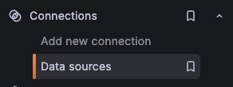

Click _Add data source_:


Select _Loki_:
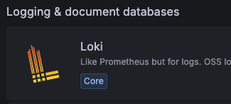

And enter the following URL for the _URL_ field:
````plain
http://loki-gateway.loki.svc.cluster.local/
````

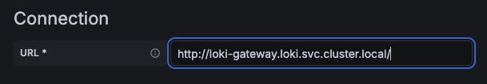

Scroll down and click _Save & test_.

### Testing
In Grafana, navigate to _Drilldown_ on the sidebar, and click _Logs_:
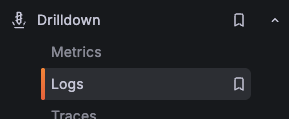


And then click _Show logs_ for _unknown_service_:
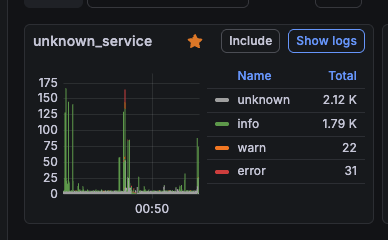

And you should, hopefully, see some logs:
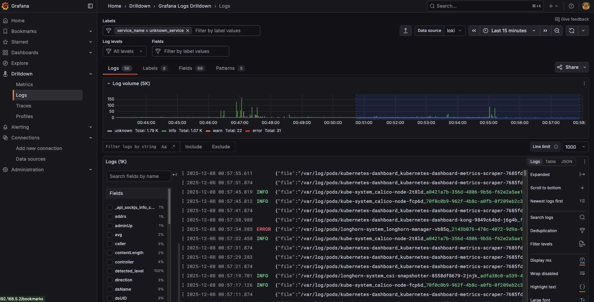


## Istio
We'll install [Istio](https://istio.io/), a Kubernetes operator, as it has many useful features.

One of the main features we can use is
[Gateway API](https://istio.io/latest/docs/tasks/traffic-management/ingress/gateway-api/), so we can have
multiple services under the same hostname, but different paths.

First, let's create a namespace:
````bash
kubectl create namespace istio-system
````

And then install Istio using Helm:
````bash
helm repo add istio https://istio-release.storage.googleapis.com/charts

helm repo update

helm upgrade --install istio-base istio/base \
  -n istio-system
````

## Postgres
We'll use the [CrunchyData Postgres Kubernetes operator](https://www.crunchydata.com/products/crunchy-high-availability-postgresql).

### Installation
Using these installation steps:
- <https://access.crunchydata.com/documentation/postgres-operator/latest/quickstart>

If git is not installed, install it:
````bash
sudo apt install git
````

First, let's clone the examples repo:
````bash
git clone https://github.com/CrunchyData/postgres-operator-examples
````

Then, install the operator:
````bash
kubectl apply -k postgres-operator-examples/kustomize/install/namespace

kubectl apply --server-side -k postgres-operator-examples/kustomize/install/default
````

And let's wait until the operator is _Running_:
````bash
kubectl -n postgres-operator get pods --selector=postgres-operator.crunchydata.com/control-plane=postgres-operator --field-selector=status.phase=Running
````

### Creating a Cluster
Then, create the file `postgres.yaml`:
````yaml
apiVersion: v1
kind: Namespace
metadata:
  name: pg-default
---
apiVersion: postgres-operator.crunchydata.com/v1beta1
kind: PostgresCluster
metadata:
  name: default
  namespace: pg-default
  annotations:
    postgres-operator.crunchydata.com/autoCreateUserSchema: "true"
spec:
  postgresVersion: 17
  users:
    - name: admin
      databases:
        - hello_world
  instances:
    - name: ha
      replicas: 2
      dataVolumeClaimSpec:
        accessModes:
        - "ReadWriteOnce"
        resources:
          requests:
            storage: 5Gi
      affinity:
        podAntiAffinity:
          preferredDuringSchedulingIgnoredDuringExecution:
          - weight: 1
            podAffinityTerm:
              topologyKey: kubernetes.io/hostname
              labelSelector:
                matchLabels:
                  postgres-operator.crunchydata.com/cluster: default
                  postgres-operator.crunchydata.com/instance-set: ha
  backups:
    pgbackrest:
      repos:
      - name: repo1
        volume:
          volumeClaimSpec:
            accessModes:
            - "ReadWriteOnce"
            resources:
              requests:
                storage: 5Gi
````

Note:
- This will deploy two replicas i.e. two database pods.
- It will try to schedule the pods on different worker nodes.
- We've avoided a spread constraint, as this Kubernetes cluster only has two worker nodes.

And then apply the file to create the Postgres cluster:
````bash
kubectl apply -f postgres.yaml
````

### Testing Cluster
We'll use pgAdmin on our local dev machine, as it features a rich UI:
- <https://www.pgadmin.org/>

Let's port forward the database to our local dev machine:
````bash
PG_CLUSTER_PRIMARY_POD=$(kubectl get pod -n pg-default -o name -l postgres-operator.crunchydata.com/cluster=default,postgres-operator.crunchydata.com/role=master)
kubectl -n pg-default port-forward "${PG_CLUSTER_PRIMARY_POD}" 5431:5432
````

Let's dump the username (ignore trailing `%`):
````bash
kubectl get secret default-pguser-admin -n pg-default -o yaml -o go-template='{{.data.user | base64decode}}'
````

And dump the password (ignore trailing `%`):
````bash
kubectl get secret default-pguser-admin -n pg-default -o yaml -o go-template='{{.data.password | base64decode}}'
````

And then register a new server in pgAdmin:
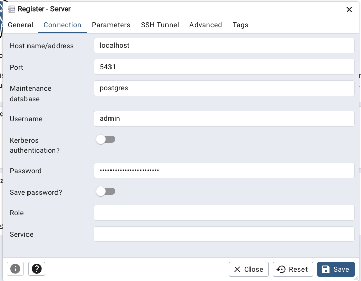

Note: the port `5431` is exposed on the dev machine, as to avoid a conflict with a local running Postgres.

Once connected, the _Activity_ tab should start to populate with statistics:
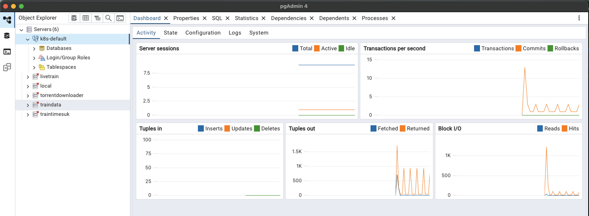
