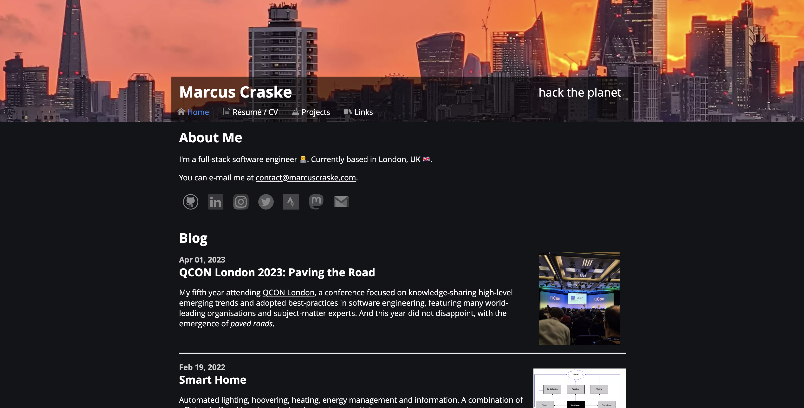
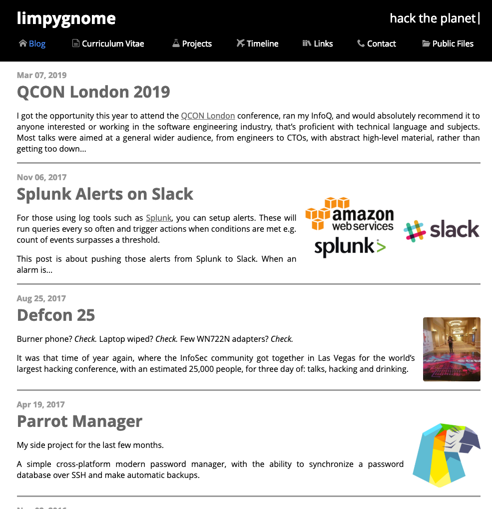
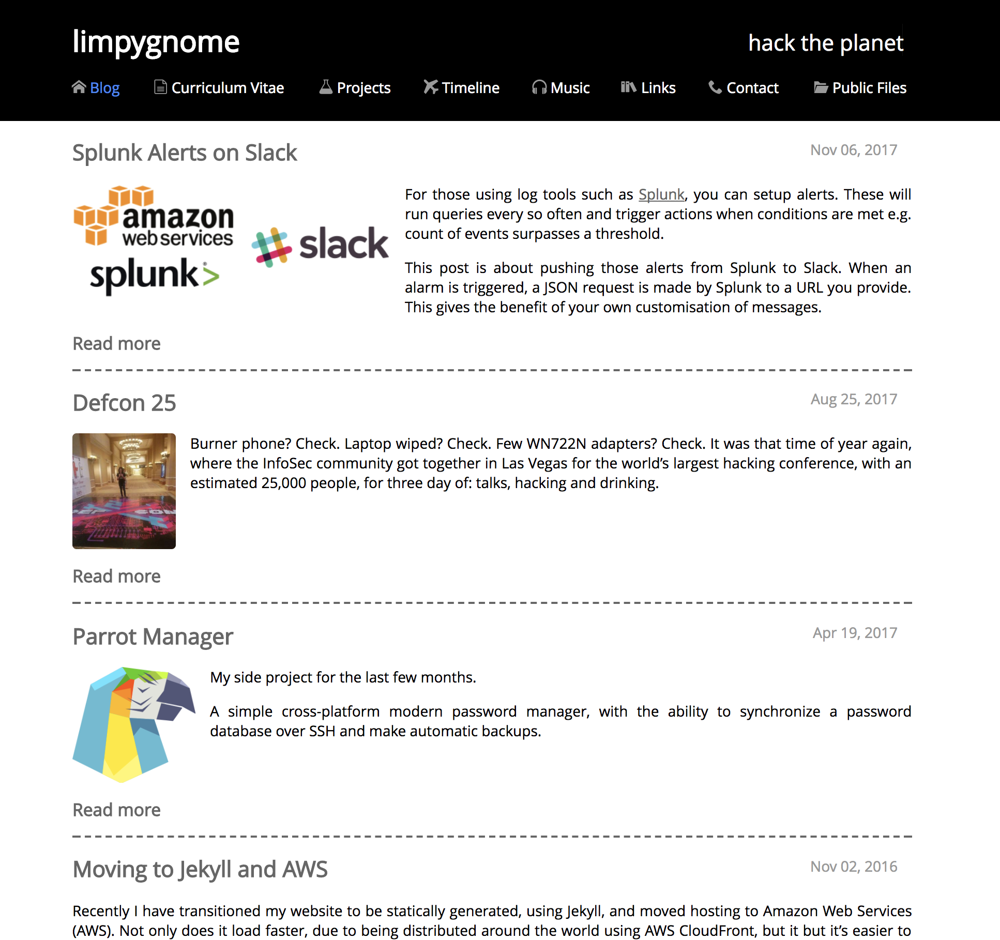
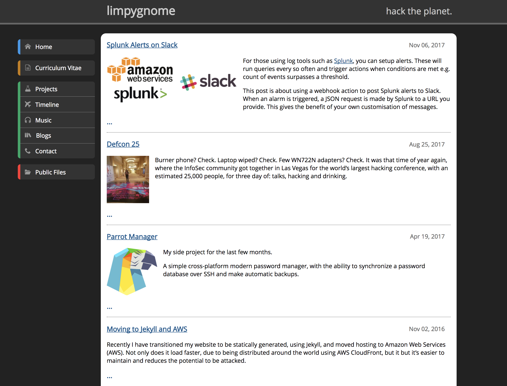

Static website [Jekyll](https://jekyllrb.com/) website, written in HTML and Markdown, using: Terraform and Cloudflare.

<!--more-->

## Features
- Responsive design
- Font icons
- WCAG 2.0 AA friendly
- Assets combined and Minified (JavaScript and CSS)
- Images compressed to png.

## Source
<https://github.com/marcuscraske/marcuscraske-dot-com>

## History
### 2023
Migrated from AWS S3 to Github for hosting, still using Cloudflare for CDN and Terraform for DNS.

### 2021
Migrated to marcuscraske.com, using CloudFlare for CDN and Terraform for deployment.

### 2019

### 2018
Design changed.

### 2017
Design slightly changed.

### 2016
[Moved to Jekyll and AWS](/2016/11/02/moving-to-jekyll-and-aws), using: AWS S3, AWS CloudFront and AWS CloudFormation.

### 2014
Using Tomcat 7 / Spring / Apache Tiles.
