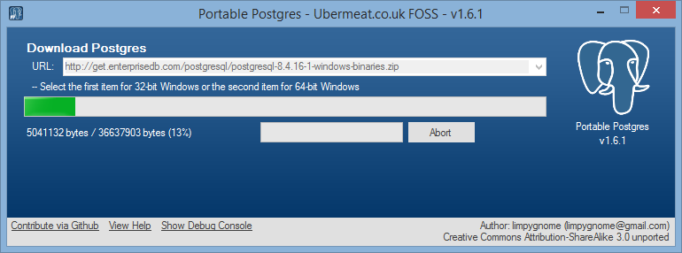
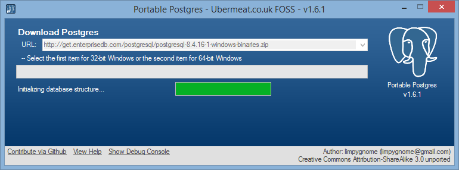
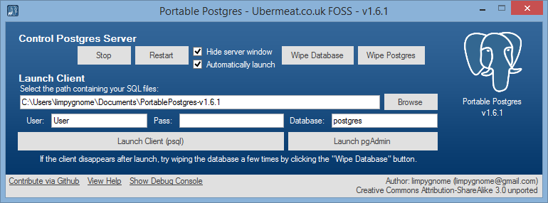
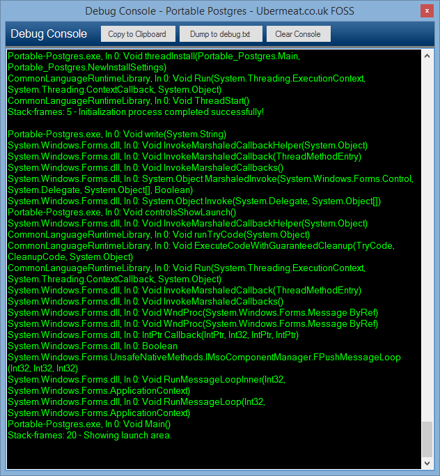
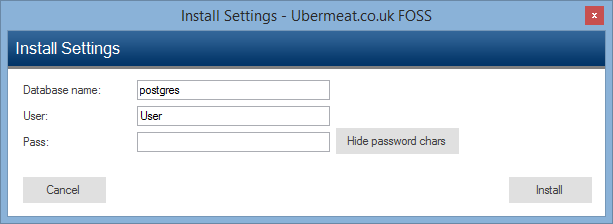
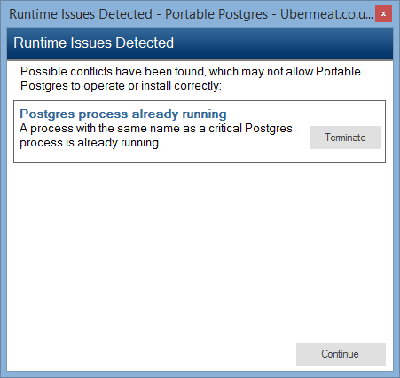

A Windows application allowing for creating and managing a portable Postgres (PostgreSQL) database server, for development.

<!--more-->

# Features
- Automated download, install and setup of Postgres.
- Automatic launch.
- Automatic setup of pgAdmin database profile.
- Launches psql command window with connection info and current directory.
- Detection of runtime issues, such as multiple instances of Postgres running and port binding.
- Wipe and reinstall within a few clicks, useful for development.

# Download
The latest binary can be found at:
<https://public.limpygnome.com/software/portable_postgres>

# Source
<https://github.com/limpygnome/Portable-Postgres>

# Screenshots
<ul class="gallery">
    <li>
        <a href="screenshot1.png" class="screenshot">
            
            Automatic download of binary files.
        </a>
    </li>
    <li>
        <a href="screenshot2.png" class="screenshot">
            
            Automatic setup of database.
        </a>
    </li>
    <li>
        <a href="screenshot3.png" class="screenshot">
            
            Main UI.
        </a>
    </li>
    <li>
        <a href="screenshot4.png" class="screenshot">
            
            Debug console.
        </a>
    </li>
    <li>
        <a href="screenshot5.png" class="screenshot">
            
            Customise setup.
        </a>
    </li>
    <li>
        <a href="screenshot6.png" class="screenshot">
            
            Automatic detection of runtime issues.
        </a>
    </li>
</ul>

# Requirements
Requires Windows XP and above, with Microsoft .NET 2.0.
